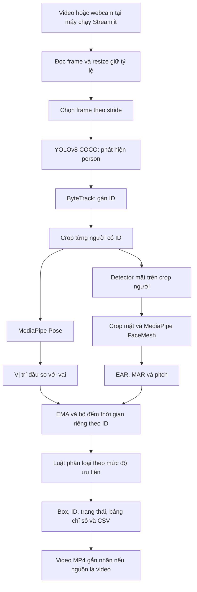

> **Cập nhật front-end:** phiên bản trong repo `samoonz/sleep_detection` dùng YOLOv8-Pose + ByteTrack để trả bbox + ID + 17 keypoints. Phần MediaPipe Pose cũ đã được thay; MediaPipe Face Detection/FaceMesh và các luật phân loại phía sau không đổi.

# Báo cáo triển khai phát hiện ngủ gật trong lớp học bằng YOLOv8-Pose, ByteTrack và MediaPipe Face

**Ngày cập nhật:** 12/09/2026  
**Phạm vi:** demo inference nhiều học viên bằng Streamlit theo [pipeline.md](pipeline.md).  
**Trạng thái:** đã có mã chạy và kiểm thử chức năng; còn hiện tượng bỏ sót học viên theo phản hồi sử dụng; chưa có đánh giá định lượng trên tập lớp học có nhãn.

Báo cáo phân biệt phương pháp thực sự có trong mã, kết quả đã kiểm chứng, hạn chế quan sát được và các bước cải tiến đề xuất. Các cấu hình đề xuất chưa được áp dụng hoặc đo đối chứng trong lần viết báo cáo này.

Báo cáo cũ về YOLOv8 fine-tune một lớp `sleep` ngày 05/09/2026 được lưu cục bộ tại `report_legacy_yolov8_sleep_2026-09-05.md` và được `.gitignore` bỏ qua. Kết quả validation của mô hình đó không phải kết quả của pipeline YOLOv8 + MediaPipe hiện tại.

## 1. Bài toán và phạm vi triển khai

Mục tiêu là nhận video lớp học hoặc webcam, xác định từng người trong khung hình, phân tích dấu hiệu mắt, miệng và tư thế, rồi hiển thị trạng thái theo thời gian. Các trạng thái gồm **Tỉnh táo, Ngáp, Gật gù, Ngủ gục** và **Thiếu dữ liệu**.

Lớp học có số người lớn, học viên phía xa có mặt nhỏ, cơ thể bị bàn và người ngồi trước che khuất, góc camera không trực diện. Đọc sách, viết bài và nói chuyện cũng có thể tạo dấu hiệu gần giống cúi đầu, ngủ gục hoặc ngáp.

Pipeline hiện tại sử dụng mô hình tiền huấn luyện. YOLOv8 phát hiện lớp `person`; trạng thái ngủ gật được suy ra bằng luật từ landmark và thời gian duy trì dấu hiệu. Chưa huấn luyện bộ phân loại trạng thái riêng trên dữ liệu lớp học.

| Thành phần | Mô hình trong báo cáo cũ | Pipeline hiện tại |
| --- | --- | --- |
| Đầu ra của YOLO | Box lớp `sleep` đã fine-tune | Box lớp `person` từ pretrained COCO |
| Xác định trạng thái | Nhãn dự đoán trực tiếp trên ảnh | EAR, MAR, pitch, đầu/vai và luật thời gian |
| Theo dõi người | Không thuộc phương pháp cũ được mô tả | ByteTrack gán ID trong video |
| Kiểm chứng | Kết quả train/validation và demo của run cũ | Test logic, luồng Streamlit và clip tích hợp |
| So sánh metric | Không chuyển trực tiếp sang recall người của pipeline mới | Cần cùng dữ liệu, định nghĩa nhãn và quy trình đánh giá |

## 2. Kiến trúc đã triển khai



Detector mặt mặc định là **MediaPipe Face Detection**. Giao diện có ô nhập weights **YOLOv8-Face** để thay detector mặt, nhưng đây là tùy chọn, không phải mô hình được nạp trong kiểm thử mặc định. Chưa có detector đầu/mặt chạy độc lập trên toàn cảnh để cứu người bị bỏ sót ở bước YOLO person.

Mã chính nằm trong [classroom_core.py](classroom_core.py); giao diện nằm trong [classroom_app.py](classroom_app.py).

## 3. Phương pháp xử lý ảnh và theo dõi

### 3.1. Tiền xử lý và phát hiện người

OpenCV đọc từng frame. Frame được thu nhỏ nếu chiều rộng vượt giới hạn cấu hình, giữ tỷ lệ ảnh và đưa kích thước về số chẵn để xuất video. Sau đó YOLO chuẩn bị ảnh theo `imgsz`.

Mặc định, giới hạn chiều rộng là 1280 pixel và `imgsz=640`. Với nguồn độ phân giải cao, chi tiết của người ở xa có thể bị giảm trước khi mô hình phát hiện. Tăng `imgsz` sau khi ảnh đã bị thu nhỏ không khôi phục chi tiết gốc.

YOLO chỉ lấy `classes=[0]`, tương ứng `person` trong model COCO được kiểm tra khi nạp weights. Box người có cạnh nhỏ hơn 16 pixel sau khi clip vào ảnh bị bỏ qua ở bước phân tích. Nguồn triển khai: `ClassroomEngine.process()` và `InferenceRun.step()` trong [classroom_core.py](classroom_core.py).

### 3.2. Tracking và quản lý ID

Hệ thống gọi `model.track(..., persist=True)` với [classroom_bytetrack.yaml](classroom_bytetrack.yaml). Chỉ kết quả đã có ID mới được đưa vào bảng và vẽ box trạng thái. Vì vậy, số người hiển thị chịu ảnh hưởng của cả detector lẫn tracker.

ByteTrack sử dụng các mức confidence khác nhau để ghép detection với track. Dự đoán ở nhóm confidence thấp có thể hỗ trợ phục hồi track đã tồn tại nhưng không tự khởi tạo track mới. Tham khảo [tài liệu tracking của Ultralytics](https://docs.ultralytics.com/modes/track/).

Mỗi ID có bộ lọc và bộ đếm riêng. Nếu ID không xuất hiện ở lần phân tích kế tiếp, lịch sử dấu hiệu của ID đó bị xóa ngay, dù ByteTrack có thể còn giữ track nội bộ. Cách này tránh cộng thời gian không quan sát được, nhưng làm chuỗi nhắm mắt/gục đầu bị ngắt khi detector bỏ sót ngắn hạn.

ID biểu thị track trong video, không phải danh tính học viên. Một người có thể nhận ID mới sau khi mất dấu; tổng số ID qua cả video không tương đương sĩ số lớp.

### 3.3. Pose và ghép mặt với người

MediaPipe Pose chạy trên crop người. Chỉ số đầu/vai được tính khi mũi và hai vai nằm trong crop, có `visibility >= 0.6`, đồng thời khoảng cách hai vai tối thiểu 15 pixel.

Detector mặt cũng chạy trên crop người. Khi có mũi từ pose, hệ thống ưu tiên mặt gần mũi. Khi không có mũi, chỉ xét mặt ở phần trên của crop; nếu còn nhiều mặt có thể ghép, bỏ qua thay vì chọn tùy ý.

Mặt có cạnh nhỏ hơn 32 pixel trên ảnh xử lý bị loại theo cấu hình mặc định. Vùng mặt hợp lệ được thêm padding và có thể phóng lớn trước khi chạy FaceMesh. Phóng lớn hỗ trợ chuẩn hóa đầu vào nhưng không tạo thêm chi tiết mắt thực sự nếu ảnh nguồn quá nhỏ hoặc mờ.

Pose và FaceMesh dùng `static_image_mode=True` để không sử dụng lịch sử crop của người trước cho người tiếp theo. Làm mượt theo thời gian được thực hiện riêng ở `StudentState`. Cách này phù hợp các crop luân phiên nhưng phải chạy phát hiện landmark lại trên từng crop được phân tích. Tham khảo API tại [MediaPipe FaceMesh 0.10.14](https://github.com/google-ai-edge/mediapipe/blob/v0.10.14/docs/solutions/face_mesh.md).

## 4. Đặc trưng và luật phân loại

### 4.1. Các chỉ số đầu vào

| Chỉ số | Cách tính trong mã | Ý nghĩa và giới hạn |
| --- | --- | --- |
| EAR | `(d(p2,p6) + d(p3,p5)) / (2*d(p1,p4))`, lấy trung bình hai mắt | Giá trị thấp là dấu hiệu mắt nhắm; cần hiệu chỉnh theo góc nhìn và người |
| MAR | `d(landmark 13,14) / d(landmark 78,308)` | Độ mở môi trong / chiều rộng miệng; nói chuyện cũng có thể làm MAR tăng |
| Pitch | `solvePnP` trên 6 landmark và mô hình mặt 3D mẫu | Góc cúi đầu xấp xỉ; camera nội tại giả định, chưa hiệu chuẩn camera thực |
| Độ gục đầu/vai | `(y_mũi - (y_vai_trái + y_vai_phải)/2) / d(vai_trái,vai_phải)` | Tăng khi mũi xuống thấp so với vai; không phải chuyển vị 3D |

Các khoảng cách EAR/MAR được tính trên tọa độ pixel, tránh sai tỷ lệ do crop không vuông. EAR dùng nhóm landmark `(33,160,158,133,153,144)` và `(362,385,387,263,373,380)`. Pitch dùng các điểm `(1,152,33,263,61,291)`.

Pitch dương được quy ước là cúi xuống. Người dùng có thể nhập pitch lúc ngồi thẳng để bù góc camera. Mã kiểm tra tính hợp lệ và sai số chiếu lại của `solvePnP`; khi ước lượng được yaw có độ lớn từ 60° trở lên, EAR/MAR bị bỏ để hạn chế suy luận từ mặt nghiêng mạnh. Nếu không tìm được góc hợp lệ, pitch bị thiếu nhưng EAR/MAR vẫn có thể được sử dụng; bộ lọc chất lượng mặt chưa bao phủ mọi trường hợp.

### 4.2. Làm mượt và đo thời gian

Mỗi chỉ số hợp lệ được làm mượt EMA theo thời gian:

```text
alpha = 1 - exp(-delta_t / tau)
smoothed_t = smoothed_previous + alpha * (value_t - smoothed_previous)
tau mặc định = 0.15 giây
```

Hệ thống theo dõi ba chuỗi bằng chứng: mắt nhắm, mở miệng và gục đầu. Chuỗi gục đầu dùng OR giữa pitch vượt ngưỡng và độ gục đầu/vai vượt ngưỡng; hai chỉ số có thể luân phiên duy trì cùng chuỗi này.

Với video, timestamp ưu tiên lấy từ video, dự phòng bằng chỉ số frame/FPS. Webcam dùng thời gian thực. Tín hiệu thiếu hoặc không còn vượt ngưỡng sẽ ngắt chuỗi tương ứng; timestamp lùi hoặc khoảng cách hai quan sát lớn hơn 1 giây sẽ reset lịch sử. Thời gian biểu thị khoảng duy trì giữa các mẫu quan sát, không chứng minh trạng thái ở mọi frame bị bỏ qua.

### 4.3. Luật quyết định thực tế

Các điều kiện sau được xét theo thứ tự ưu tiên trên tín hiệu đã làm mượt:

| Ưu tiên | Trạng thái | Điều kiện mặc định |
| ---: | --- | --- |
| 1 | Ngủ gục | Mắt nhắm liên tục hoặc chuỗi gục đầu liên tục đạt ít nhất 2.5 giây |
| 2 | Gật gù | Mắt nhắm liên tục hoặc chuỗi gục đầu liên tục đạt ít nhất 0.8 giây |
| 3 | Ngáp | Mở miệng liên tục đạt ít nhất 0.8 giây |
| 4 | Tỉnh táo | Có EAR hợp lệ và chưa đạt các điều kiện trên |
| 5 | Thiếu dữ liệu | Không có EAR hợp lệ và chưa đủ bằng chứng cho nhãn ưu tiên cao hơn |

Ngưỡng kích hoạt: `EAR < 0.21`, `MAR > 0.60`, `pitch - pitch_offset > 25°`, hoặc độ gục đầu/vai `> -0.10`.

Đây là OR-rule phân cấp: nhắm mắt lâu được xét độc lập với ngáp; tư thế gục đầu kéo dài được xét dù không thấy mặt. Mất mặt đơn thuần không đủ kết luận ngủ gục. “Tỉnh táo” trong demo có nghĩa chưa đạt điều kiện cảnh báo khi có EAR hợp lệ; một lần chớp mắt ngắn vẫn có thể mang nhãn này.

“Gật gù” hiện là nhãn theo dấu hiệu kéo dài, chưa có thuật toán nhận diện chu kỳ gật đầu. “Ngủ gục” là nhãn của luật thị giác, chưa được xác nhận bằng đánh giá trạng thái thực của học viên.

CSV có thêm điểm tham khảo:

```text
score = 0.4 * min(thời_gian_nhắm_mắt / 2.5, 1)
      + 0.2 * min(thời_gian_mở_miệng / 0.8, 1)
      + 0.4 * min(thời_gian_gục_đầu / 2.5, 1)
```

Các mẫu số thay đổi theo ngưỡng người dùng đặt. `score` không phải xác suất và không trực tiếp chọn nhãn; bảng luật ở trên quyết định nhãn. Ví dụ, chỉ nhắm mắt lâu có thể cho nhãn ngủ gục dù score chỉ bằng 0.4.

## 5. Cấu hình và chức năng hiện có

### 5.1. Cấu hình mặc định

| Tham số | Giá trị hiện tại |
| --- | --- |
| Weights người | `yolov8n.pt`, pretrained COCO |
| Detector mặt | MediaPipe Face Detection, `model_selection=1` |
| Confidence người | 0.35 |
| YOLO `imgsz` | 640 |
| Số detection tối đa mỗi frame | 20; giao diện cho chọn tối đa 50 |
| Chiều rộng video xử lý tối đa | 1280 pixel |
| Stride | 2 frame |
| ByteTrack high / low / new-track | 0.25 / 0.10 / 0.25 |
| ByteTrack `track_buffer` / `match_thresh` | 30 / 0.8 |
| Thiết bị | YOLO tự chọn CUDA nếu có; MediaPipe Solutions chạy CPU trong cấu hình này |

Môi trường `venv` được đối chiếu ngày 12/09/2026: Ultralytics 8.2.73, MediaPipe 0.10.14, Streamlit 1.37.1, PyTorch 2.4.0, NumPy 1.26.4 và lapx 0.5.9. Dependency được khai báo tại [requirements-classroom.txt](requirements-classroom.txt).

### 5.2. Giao diện và đầu ra

Ứng dụng hỗ trợ tải video, nhập đường dẫn video và webcam cắm vào máy chạy Streamlit. Webcam không phải camera trình duyệt từ xa. Người dùng chọn weights, thiết bị, confidence, kích thước ảnh, số người, stride và các ngưỡng trước mỗi lượt chạy.

Giao diện có nút bắt đầu, dừng và lưu phần đã xử lý; preview box/ID/landmark; bảng chỉ số từng người; thống kê theo ID và tải CSV. Với video, ứng dụng xuất MP4 và thử mã hóa H.264 để phát trên trình duyệt. Webcam chỉ có preview và CSV.

Video xuất không có âm thanh và lặp lại khung hình vừa infer ở frame bị bỏ qua. Với video FPS cố định, cách này giữ số frame và thời lượng; nguồn FPS biến thiên có thể có thời lượng đầu ra sai khác.

CSV ghi timestamp, ID, confidence, EAR/MAR/pitch, độ gục đầu/vai, thời gian dấu hiệu, trạng thái, lý do và cờ có landmark. Bảng tổng hợp đếm **số lần quan sát theo trạng thái**, chưa đếm số sự kiện hoặc số phút ngủ.

FPS trên giao diện là số lần chạy `engine.process()` chia cho thời gian các lần gọi đó, gồm YOLO, tracking, MediaPipe và vẽ overlay. Nó không gồm đọc/ghi video, cập nhật giao diện hoặc mã hóa H.264. “Thời gian xử lý” cũng được chốt trước mã hóa cuối; cần bổ sung phép đo từ đầu đến cuối để đánh giá vận hành.

## 6. Kết quả thực tế và mức độ kiểm chứng

### 6.1. Kiểm thử tự động

Ngày 12/09/2026, chạy lại lệnh dưới đây cho kết quả **16/16 test đạt**:

```bash
venv/bin/python -m unittest discover -s tests -v
```

[Test hiện có](tests/test_classroom_core.py) kiểm tra chớp mắt ngắn, nhắm mắt lâu độc lập, ngáp độc lập, gục đầu khi mất mặt, mất tín hiệu, timestamp gián đoạn, tách lịch sử hai người, khoảng lấy mẫu, bù pitch, NaN/Inf, hình học EAR và quy ước pitch. Test xuất video dùng engine giả để kiểm tra stride, số frame, H.264 và thu hồi tài nguyên.

Các test xác nhận hành vi phần mềm trên đầu vào kiểm thử. Chúng không đo khả năng YOLO tìm đủ học viên hoặc MediaPipe dự đoán đúng landmark trong lớp học.

### 6.2. Clip tích hợp hai vùng người

Clip kiểm thử phát triển ghép hai đoạn đầu từ `inputs/d_2.mp4` và `inputs/d_6.mp4`, giữ đúng tỷ lệ ảnh. Đây là video tài xế, không phải lớp học đông người và không chứng minh nhận dạng hai cá nhân khác nhau.

Artifact được đọc lại ngày 12/09/2026 cho kết quả:

| Chỉ số kiểm tra | Kết quả |
| --- | --- |
| Video kết quả | 720 × 640 pixel, 30 FPS, 18 frame |
| Thời lượng | 0.6 giây |
| Stride lần thử | 3, khác mặc định demo là 2 |
| Timestamp có inference | 0.0; 0.1; 0.2; 0.3; 0.4; 0.5 giây |
| ID trong CSV | 1 và 2 |
| Tổng quan sát | 12 = 6 thời điểm × 2 ID |
| Có landmark mặt | 12/12 quan sát |
| Có chỉ số pose hợp lệ | 12/12 quan sát |
| Trạng thái xuất ra | 12 dòng `awake` |

Nguồn: [CSV kiểm thử](outputs/classroom_smoke.csv), [video kết quả](outputs/classroom_smoke.mp4) và [ảnh preview](outputs/classroom_smoke_preview.jpg). File trong `outputs/` là artifact cục bộ đang được Git ignore; cần sao chép kèm nếu chia sẻ báo cáo cùng bằng chứng.

Tỷ lệ 12/12 chỉ là tỷ lệ có landmark trong clip rất ngắn. Đây không phải recall người, độ chính xác landmark hoặc độ chính xác phát hiện ngủ gật. Clip ngắn hơn ngưỡng 0.8 giây nên cũng không kiểm chứng chuyển trạng thái gật gù/ngáp trên video thật.

### 6.3. Giao diện và phản hồi sử dụng

Trong phiên phát triển trước, kiểm thử Streamlit bằng AppTest đã chạy qua nạp video, hoàn tất và tạo nút tải MP4/CSV, dừng giữa chừng và giải phóng tài nguyên, báo lỗi khi thiếu weights. Đây là kiểm tra luồng ứng dụng đã ghi nhận; không phải kiểm thử webcam hoặc khả năng giải mã trên mọi trình duyệt.

Phản hồi thực tế của người dùng là **YOLOv8 chưa bắt được hết học viên trong video**. Đây là vấn đề đang tồn tại. Chưa có tập frame được đánh dấu ground truth và cấu hình lượt chạy đó để định lượng số bỏ sót hay xác định nguyên nhân chính.

| Hạng mục | Bằng chứng hiện có |
| --- | --- |
| Luật trạng thái và thời gian | Có test tự động |
| Tích hợp model trên hai vùng người | Có clip và CSV ngắn |
| Bắt đầu/dừng/xuất kết quả | Đã kiểm tra trong phiên phát triển |
| Phát hiện đủ học viên lớp đông | Người dùng phản hồi chưa đạt; chưa có metric |
| Precision/recall trạng thái ngủ gật | Chưa có tập test lớp học có nhãn |
| Realtime với sĩ số thực tế | Chưa có benchmark đại diện trên phần cứng đích |
| Webcam vật lý | Chưa kiểm thử thực tế |
| YOLOv8-Face tùy chọn | Có mã tích hợp; chưa thử với weights mặt cụ thể |

## 7. Phân tích bỏ sót và hạn chế

### 7.1. Các nguyên nhân cần phân biệt

| Yếu tố | Bằng chứng từ mã/cấu hình | Tác động có thể xảy ra |
| --- | --- | --- |
| Giới hạn số người | `max_det=20` mặc định | Nếu hơn 20 người cần phát hiện cùng frame, không thể trả đủ |
| Confidence YOLO | Lọc ở 0.35 | Dự đoán yếu bị loại trước tracking |
| Ngưỡng tracker | High/new-track đều 0.25 | Chỉ giảm confidence xuống 0.20 chưa cho phép detection 0.20–0.25 tự tạo ID |
| Nhóm detection yếu | ByteTrack low/high là 0.10/0.25, nhưng YOLO lọc ở 0.35 | Nhánh ghép detection confidence thấp không nhận được ứng viên trong khoảng này |
| Độ phân giải | Giới hạn chiều rộng 1280 rồi YOLO dùng `imgsz=640` | Người phía xa có thể thiếu chi tiết |
| Chỉ hiển thị người có ID | Điều kiện trong `ClassroomEngine.process()` | Detection chưa được xác nhận track có thể không hiện box |
| Crop người rất nhỏ | Cạnh < 16 pixel bị bỏ | Có detection nhưng không được phân tích/hiển thị trạng thái |
| Bàn/người che cơ thể | Đặc điểm bài toán; chưa lượng hóa trên video phản hồi | Pretrained detector có thể bỏ sót vùng chỉ lộ đầu/vai |
| Phụ thuộc detector người | Chỉ tìm mặt trong crop người | Detector mặt tùy chọn không cứu người đã mất từ giai đoạn đầu |

Ví dụ, nếu ground truth có 40 người nhìn thấy được trong một frame, giới hạn 20 detection đặt trần recall lý thuyết ở 50% cho frame đó, ngay cả khi mọi detection đều đúng. Đây là ví dụ từ giới hạn cấu hình, không phải recall đã đo trên video người dùng.

Ngưỡng mặt 32 pixel ảnh hưởng khả năng lấy landmark và phân loại. Giảm ngưỡng này không sửa giới hạn sĩ số hoặc người chưa được YOLO phát hiện; cần điều chỉnh đúng tầng.

### 7.2. Phân loại và hiệu năng

Luật hiện tại chưa phân biệt tốt cúi viết với ngủ gục, nói chuyện với ngáp, hoặc đầu cúi do góc camera. Landmark nhiễu có thể duy trì tín hiệu sai; mất ID một lần có thể reset sự kiện đang diễn ra. Khoảng trống > 1 giây có thể liên tục reset bộ đếm nếu webcam xử lý quá chậm.

Chi phí MediaPipe tăng theo số crop. Nâng giới hạn lên 50 người hoặc tăng recall có thể làm toàn pipeline chậm hơn, kể cả khi riêng YOLO còn nhanh. Video/CSV kết quả được giữ trong bộ nhớ phiên để tải; chưa kiểm thử tải kéo dài với nhiều phiên hoặc video dài.

## 8. Đề xuất cải tiến

### 8.1. Ưu tiên 0: xác định tầng bị mất người

Bổ sung chế độ chẩn đoán gồm box trước tracker, confidence, box có/không có ID, crop bị loại và trạng thái thiếu landmark. Cần lấy detection trước tracker hoặc dùng instance detector riêng để đối chiếu; kết quả cuối `model.track()` không biểu diễn đầy đủ mọi dự đoán gốc.

Mục tiêu là phân biệt detector bỏ sót, tracker chưa gán ID, crop quá nhỏ và landmark thất bại. Chức năng này chưa có trong UI hiện tại.

### 8.2. Ưu tiên 1: cấu hình inference và tracker

| Tham số | Hiện tại | Đề xuất thử lần lượt | Chi phí cần theo dõi |
| --- | --- | --- | --- |
| Số người tối đa | 20 | 40–50, cao hơn sĩ số nhìn thấy; sửa UI nếu cần hơn 50 | Tăng crop MediaPipe |
| Confidence người | 0.35 | 0.25 rồi 0.20 | Tăng detection giả |
| YOLO `imgsz` | 640 | 960 rồi 1280 | Tăng tính toán/bộ nhớ |
| Chiều rộng video | 1280 | 1920 nếu nguồn đủ chi tiết | Không phục hồi ảnh nguồn mờ |
| Stride | 2 | 1 khi đánh giá chất lượng | Tăng inference; không tự sửa recall ảnh đơn |
| ByteTrack high/new-track | 0.25/0.25 | 0.20/0.20 khi thử confidence 0.20 | Dễ tạo track giả, cần đo ID switch |

Để thử nhánh phục hồi detection yếu, có thể đánh giá riêng YOLO confidence 0.10, tracker low 0.10, high/new-track 0.20. Không coi ngưỡng thấp là tối ưu mặc định. Tham khảo [cơ chế ngưỡng ByteTrack](https://docs.ultralytics.com/modes/track/).

Nếu chẩn đoán cho thấy box hai người chồng lấn bị NMS loại, có thể thử tăng IoU NMS từ mặc định thư viện đang cài là 0.70 lên 0.75–0.80; cần kiểm tra box trùng. IoU NMS khác `match_thresh` của tracker. Tham khảo các tham số `conf`, `imgsz`, `max_det`, `iou` trong [tài liệu Predict](https://docs.ultralytics.com/modes/predict/).

### 8.3. Ưu tiên 2: YOLOv8s hoặc YOLOv8m

So sánh `yolov8n.pt` với `yolov8s.pt`, sau đó `yolov8m.pt` nếu đủ tài nguyên. Bản s/m có độ chính xác COCO công bố cao hơn bản n và chi phí tính toán lớn hơn; chưa đảm bảo mức tăng recall tương ứng trên lớp học. Tham khảo [bảng YOLOv8 của Ultralytics](https://docs.ultralytics.com/models/yolov8/).

UI đã cho nhập weights nhưng file phải tồn tại; ứng dụng không tự tải khi đường dẫn thiếu. So sánh trên cùng frame, confidence, `imgsz`, giới hạn detection và thiết bị trước khi tối ưu riêng từng model.

### 8.4. Ưu tiên 3: tiled inference cho người phía xa

Cắt ảnh gốc thành các ô chồng lấn, chạy YOLO từng ô, chuyển box về toàn ảnh, ghép và loại trùng, rồi đưa detections vào một tracker toàn cảnh. Có thể bắt đầu khảo sát ô 640–960 pixel và chồng lấn khoảng 20%; chưa phải cấu hình được xác nhận.

Chia ô giúp người nhỏ chiếm nhiều pixel đầu vào model hơn. Tổng số lần chạy YOLO thường tăng; cần ô đủ rộng để thấy ngữ cảnh người và xử lý box ở biên. Không tracking độc lập từng ô vì cùng người có thể nhận nhiều ID. Tham khảo [nguyên lý SAHI](https://docs.ultralytics.com/guides/sahi-tiled-inference/). Demo hiện chưa có tiled inference.

### 8.5. Ưu tiên 4: detector đầu/mặt toàn cảnh

Nếu lỗi chủ yếu do bàn che cơ thể, thêm nhánh phát hiện đầu/mặt trên toàn cảnh hoặc các ô, rồi ghép với person box để tránh đếm trùng. Khi chỉ có mặt, có thể phân tích EAR/MAR/pitch; không coi face box là đủ dữ liệu cho pose cơ thể.

Đây là thay đổi kiến trúc cần weights phù hợp và kiểm tra ghép người. Nó khác ô weights YOLOv8-Face hiện tại, vốn chỉ thay detector mặt bên trong crop người đã tìm được.

### 8.6. Mở rộng về dữ liệu, thời gian và tốc độ

Nếu phạm vi cho phép huấn luyện, fine-tune detector trên người ngồi trong lớp, nhiều kích thước và mức che khuất. Cần gán nhãn **mọi người theo quy ước nhất quán**; nhãn `sleep` của hướng cũ không đủ thay thế nhãn person. Chia train/validation/test theo video, buổi học hoặc camera, tránh frame gần nhau ở cả train và test.

Với thời gian, có thể giữ hồ sơ ID qua mất dấu ngắn nhưng đánh dấu khoảng đó là không quan sát được, không cộng vào nhắm mắt/gục đầu liên tục. Hướng tiếp theo gồm hiệu chỉnh theo người, hysteresis, phát hiện chu kỳ gật đầu và đếm sự kiện có điểm đầu/cuối. Cần tránh nối nhầm hai sự kiện hoặc hai người.

Với tốc độ, đo chi phí từng tầng trước khi thử CUDA, backend xuất model phù hợp hoặc giảm tần suất landmark theo ID trong khi vẫn tracking người. Camera cố định có thể thử ROI ghế ngồi để giảm nền. Các tối ưu này chưa được benchmark; cần kiểm tra đồng thời recall, độ trễ và bộ nhớ.

## 9. Kế hoạch đánh giá đề xuất

### 9.1. Dữ liệu và ground truth

Lập tập frame/clip lớp học đại diện: hàng ghế gần/xa, người ngồi sát nhau, cúi viết, nói chuyện, ngáp, mắt nhắm lâu và che khuất. Quy định rõ đối tượng đủ nhìn thấy để gán box, người che hoàn toàn và trạng thái không thể xác định.

Tách nhãn thành hai tầng: box/ID người và trạng thái/sự kiện theo thời gian. Chia tập hiệu chỉnh và kiểm tra cuối theo video/buổi học; không chọn ngưỡng trên chính tập báo cáo kết quả cuối.

### 9.2. Chỉ số cần đo

| Tầng | Chỉ số và cách diễn giải |
| --- | --- |
| Person detection | Recall = TP/(TP+FN), precision = TP/(TP+FP), ghép box một-một theo IoU quy định trước; báo riêng người nhỏ/che khuất |
| Tracking | Tỷ lệ người có ID đúng, ID switch, track bị đứt; không dùng tổng ID làm sĩ số |
| Landmark | Tỷ lệ có EAR/MAR/pose hợp lệ trên toàn bộ ground truth đủ điều kiện, kèm tỷ lệ có điều kiện trên người đã detect |
| Trạng thái | Precision/recall/F1 từng nhãn, confusion matrix và tỷ lệ thiếu dữ liệu; không âm thầm bỏ trường hợp thiếu dữ liệu |
| Sự kiện | Recall sự kiện, cảnh báo giả mỗi người-giờ, độ trễ cảnh báo; định nghĩa trước quy tắc ghép sự kiện |
| Hiệu năng | FPS inference, FPS toàn pipeline, độ trễ trung vị/p95, CPU/GPU, RAM/VRAM và ảnh hưởng sĩ số |

Benchmark ghi rõ phần cứng, phiên bản, độ phân giải, model, số người, stride, thiết bị và có/không tính mã hóa. Tách thời gian nạp model khỏi tốc độ ổn định; với webcam đo cả độ trễ frame và khả năng giữ mới dữ liệu camera.

### 9.3. Trình tự thí nghiệm

1. Đo baseline đúng cấu hình hiện tại và lưu frame bỏ sót.
2. Tháo giới hạn sĩ số, đo lại; tiếp theo thử từng thay đổi confidence, tracker, độ phân giải.
3. So sánh n/s/m trên cùng frame và điều kiện đo.
4. Thử tiled inference nếu lỗi tập trung ở phía xa; thử detector đầu/mặt nếu lỗi tập trung ở người bị bàn che.
5. Chọn cấu hình trên tập hiệu chỉnh theo mục tiêu recall, mức nhận nhầm và độ trễ đã thống nhất.
6. Đánh giá trên tập độc lập, lưu cấu hình và artifact đầy đủ để tái lập.

Chưa đặt mục tiêu số cụ thể về recall/FPS vì chưa có baseline lớp học và thông tin phần cứng đích. Các đề xuất là giả thuyết cần kiểm chứng, không phải mức cải thiện đã đạt.

## 10. Cách chạy và nguồn đối chiếu

```bash
source venv/bin/activate
python -m pip install -r requirements-classroom.txt
python -m streamlit run classroom_app.py
```

Ứng dụng mở tại `http://localhost:8501`. Hướng dẫn cài mới bằng Python 3.10/3.11 nằm trong [README.md](README.md).

| Nguồn trong dự án | Nội dung đối chiếu |
| --- | --- |
| [pipeline.md](pipeline.md) | Bài toán và kiến trúc ban đầu |
| [classroom_core.py](classroom_core.py) | Detection, tracking, landmark, luật thời gian, đọc/ghi video |
| [classroom_app.py](classroom_app.py) | UI, nguồn đầu vào, hiển thị và tải kết quả |
| [classroom_bytetrack.yaml](classroom_bytetrack.yaml) | Ngưỡng tracker thực tế |
| [requirements-classroom.txt](requirements-classroom.txt) | Phiên bản dependency |
| [tests/test_classroom_core.py](tests/test_classroom_core.py) | 16 test logic, hình học và xuất video |
| [outputs/classroom_smoke.csv](outputs/classroom_smoke.csv) | Quan sát clip hai vùng người |
| [outputs/classroom_smoke.mp4](outputs/classroom_smoke.mp4) | Video gắn nhãn kiểm thử |

Tài liệu Ultralytics trực tuyến có thể mô tả phiên bản mới hơn. Báo cáo lấy mã đang chạy với Ultralytics 8.2.73 và MediaPipe 0.10.14 làm căn cứ cho hành vi hiện tại, dùng nguồn bên ngoài để đối chiếu API và phương án mở rộng.
